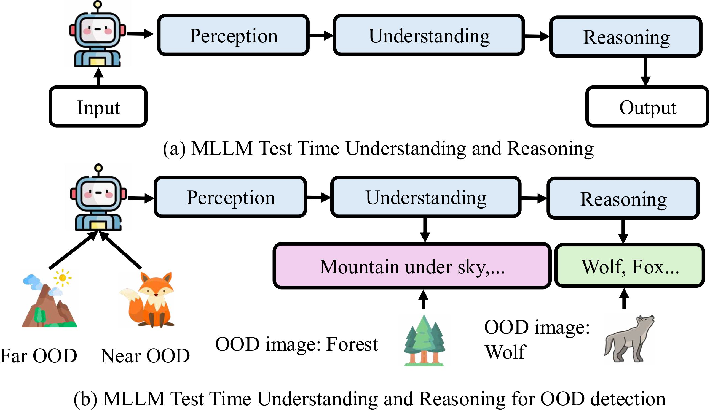
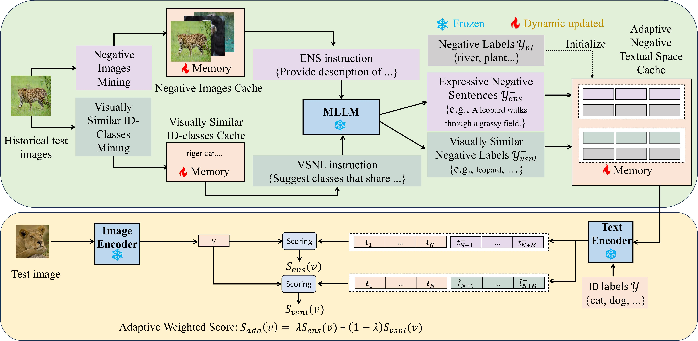

## ANTS: Adaptive Negative Textual Space Shaping for OOD Detection via Test-Time MLLM Understanding and Reasoning(CVPR2026)


<a href='https://www.arxiv.org/abs/2509.03951'></a> &nbsp;&nbsp;

[Wenjie Zhu](https://scholar.google.com/citations?hl=en&authuser=1&user=8hodVdAAAAAJ)<sup>1,2</sup> | [Yabin Zhang](https://scholar.google.com/citations?user=p0GLwtoAAAAJ&hl=en)<sup>3</sup> | [Xin Jin](https://scholar.google.com/citations?user=byaSC-kAAAAJ&hl=zh-CN)<sup>2,4</sup> | [Wenjun Zeng](https://scholar.google.com/citations?user=_cUfvYQAAAAJ&hl=en)<sup>2</sup> | [Lei Zhang](https://www4.comp.polyu.edu.hk/~cslzhang/)<sup>1</sup>

<sup>1</sup>The Hong Kong Polytechnic University, <sup>2</sup>Eastern Institute of Technology, Ningbo, <sup>3</sup>Harbin Institute of Technology (Shenzhen). <sup>4</sup>Zhongguancun Academy


If ANTS is helpful to your images or projects, please help star this repo. Thanks!
## 🔥 News
- **21 Feb, 2026**: Our ANTS has been accepted by CVPR2026
- **05 Sep, 2025**: The paper is available in arxiv.
- **01 Sep, 2025**: Create this repo.

### 📌 TODO
- [ ] Merge code into OpenOOD-VLM

## 🔎 Test-Time MLLM Understanding and Reasoning
<div align=center class="logo">
      
   </a>
</div>

## 🔎 Overview framework
<div align=center class="logo">
      
   </a>
</div>

## ⚙️ Dependencies and Installation
<details>
  <summary>Follow OpenOOD to set up the environment, or use our provided instructions below.</summary>

  pip install git+https://github.com/ZhuWenjie98/ANTS.git

</details>

## 📷 Datasets
We also follow OpenOOD to manage the training and testing datasets.
If you only use our evaluator, the benchmarks for evaluation will be automatically downloaded by the evaluator (again check out this [tutorial](https://colab.research.google.com/drive/1tvTpCM1_ju82Yygu40fy7Lc0L1YrlkQF?usp=sharing)). If you would like to also use OpenOOD-VLM for training, you can get all data with our [downloading script](https://github.com/Jingkang50/OpenOOD/tree/main/scripts/download). Note that ImageNet-1K training images should be downloaded from its official website.

Besides datasets used in OpenOOD, we also provide evaluation on some popular OOD datasets [iNaturalist](https://arxiv.org/abs/1707.06642), [SUN](https://vision.princeton.edu/projects/2010/SUN/), [Places](https://arxiv.org/abs/1610.02055), and [Texture](https://arxiv.org/abs/1311.3618) curated by [Huang et al. 2021](https://arxiv.org/abs/2105.01879). Please follow instruction from the this [repository](https://github.com/deeplearning-wisc/large_scale_ood#out-of-distribution-dataset) to download the subsampled datasets where semantically overlapped classes with ImageNet-1k are removed.

Our codebase accesses the datasets from `./data/` and pretrained models from `./results/checkpoints/` by default.
```
├── ...
├── data
│   ├── benchmark_imglist
│   ├── images_classic
│   └── images_largescale
├── openood
├── results
│   ├── checkpoints
│   └── ...
├── scripts
├── main.py
├── ...
```

<details>
<summary><b>Supported Datasets for Out-of-Distribution Detection</b></summary>

> - [x] [BIMCV (A COVID X-Ray Dataset)]()
>      > Near-OOD: `CT-SCAN`, `X-Ray-Bone`;<br>
>      > Far-OOD: `MNIST`, `CIFAR-10`, `Texture`, `Tiny-ImageNet`;<br>
> - [x] [MNIST]()
>      > Near-OOD: `NotMNIST`, `FashionMNIST`;<br>
>      > Far-OOD: `Texture`, `CIFAR-10`, `TinyImageNet`, `Places365`;<br>
> - [x] [CIFAR-10]()
>      > Near-OOD: `CIFAR-100`, `TinyImageNet`;<br>
>      > Far-OOD: `MNIST`, `SVHN`, `Texture`, `Places365`;<br>
> - [x] [CIFAR-100]()
>      > Near-OOD: `CIFAR-10`, `TinyImageNet`;<br>
>      > Far-OOD: `MNIST`, `SVHN`, `Texture`, `Places365`;<br>
> - [x] [ImageNet-200]()
>      > Near-OOD: `SSB-hard`, `NINCO`;<br>
>      > Far-OOD: `iNaturalist`, `Texture`, `OpenImage-O`;<br>
>      > Covariate-Shifted ID: `ImageNet-C`, `ImageNet-R`, `ImageNet-v2`;
> - [x] [ImageNet-1K]()
>      > Near-OOD: `SSB-hard`, `NINCO`;<br>
>      > Far-OOD: `iNaturalist`, `Texture`, `OpenImage-O`;<br>
>      > Covariate-Shifted ID: `ImageNet-C`, `ImageNet-R`, `ImageNet-v2`;
> - [x] [ImageNet-1K Traditional Four Datasets]()
>      > Far-OOD: `iNaturalist`, `SUN`, `Places`, `Texture`;<br>
>      > Covariate-Shifted ID: `ImageNet-C`, `ImageNet-R`, `ImageNet-v2`;
</details>

## 🚀 Test time understanding and reasoning
We provide the evaluation scripts for all the methods we support in [scripts folder]().

