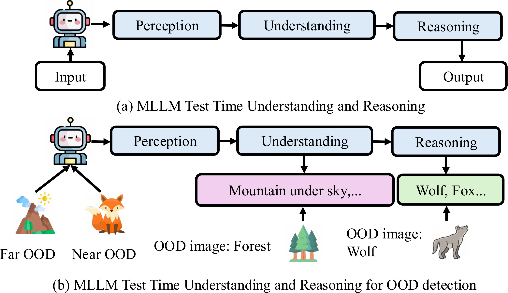
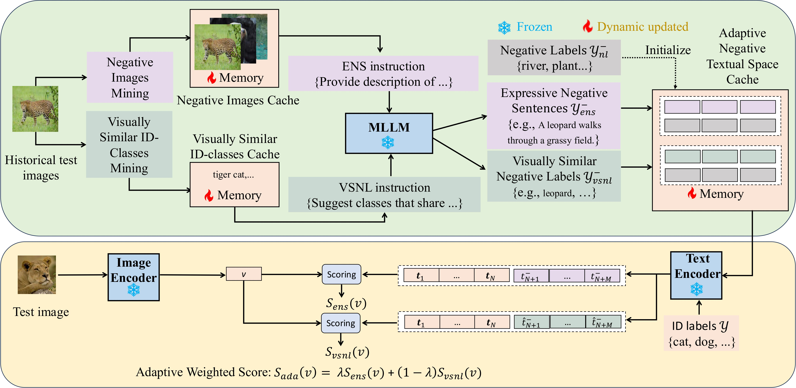

<div align="center">

<p align="center">
  
</p>

### Adaptive Negative Textual Space Shaping for OOD Detection  
### via Test-Time MLLM Understanding and Reasoning

<p>
  <a href="https://arxiv.org/abs/2509.03951">
    
  </a>
  <a href="https://github.com/ZhuWenjie98/ANTS">
    
  </a>
  <a href="https://github.com/YBZh/OpenOOD-VLM">
    
  </a>
  
</p>

<p>
  <a href="https://scholar.google.com/citations?hl=en&authuser=1&user=8hodVdAAAAAJ">Wenjie Zhu</a><sup>1,2,*</sup>
  &nbsp;·&nbsp;
  <a href="https://scholar.google.com/citations?user=p0GLwtoAAAAJ&hl=en">Yabin Zhang</a><sup>3,*</sup>
  &nbsp;·&nbsp;
  <a href="https://scholar.google.com/citations?user=byaSC-kAAAAJ&hl=zh-CN">Xin Jin</a><sup>2,4</sup>
  &nbsp;·&nbsp;
  <a href="https://scholar.google.com/citations?user=_cUfvYQAAAAJ&hl=en">Wenjun Zeng</a><sup>2,†</sup>
  &nbsp;·&nbsp;
  <a href="https://www4.comp.polyu.edu.hk/~cslzhang/">Lei Zhang</a><sup>1,†</sup>
</p>

<p>
  <sup>1</sup>The Hong Kong Polytechnic University &nbsp;&nbsp;
  <sup>2</sup>Eastern Institute of Technology, Ningbo<br>
  <sup>3</sup>Harbin Institute of Technology (Shenzhen) &nbsp;&nbsp;
  <sup>4</sup>Zhongguancun Academy
</p>

<p>
  <sup>*</sup>Equal contribution &nbsp;&nbsp; <sup>†</sup>Corresponding authors
</p>

<p><b>Training-free · Zero-shot · No auxiliary outlier images · Adaptive to Near- and Far-OOD</b></p>

[Paper](https://arxiv.org/abs/2509.03951) ·
[Code](https://github.com/ZhuWenjie98/ANTS) ·
[OpenOOD-VLM](https://github.com/YBZh/OpenOOD-VLM)

</div>

---

## 🔥 News

- **2026.03.30** — ANTS was merged into [OpenOOD-VLM](https://github.com/YBZh/OpenOOD-VLM).
- **2026.02.21** — 🎉 ANTS was accepted as a **CVPR 2026 Oral**.
- **2025.09.05** — The paper was released on [arXiv](https://arxiv.org/abs/2509.03951).
- **2025.09.01** — The repository was initialized.

## ✨ Highlights

- **Test-time MLLM understanding and reasoning.** ANTS uses an MLLM during inference to understand likely OOD images and reason about visually similar categories.
- **Adaptive negative textual space.** It dynamically constructs two complementary text spaces for far-OOD and near-OOD detection.
- **Training-free and zero-shot.** ANTS requires no learnable parameters and no auxiliary outlier images.
- **Strong and scalable performance.** ANTS achieves state-of-the-art results on ImageNet-1K and OpenOOD benchmarks while remaining compatible with different VLM backbones and MLLMs.
- **OpenOOD-VLM integration.** The method is available as part of the broader OpenOOD-VLM codebase.

## 💡 Motivation

Existing negative-label-based OOD detectors face three major challenges:

| Challenge | Limitation | ANTS solution |
|---|---|---|
| Limited OOD understanding | Static or corpus-mined negative labels can remain semantically far from actual OOD images. | Generate **Expressive Negative Sentences (ENS)** from online-mined negative images. |
| Weak near-OOD detection | Near-OOD samples are visually and semantically close to a subset of ID classes. | Generate **Visually Similar Negative Labels (VSNL)** only for the relevant ID-class subset. |
| Unknown test environment | Prior methods often assume that the target scenario is known as near-OOD or far-OOD. | Use an **adaptive weighted score** to balance ENS and VSNL automatically. |

<p align="center">
  
</p>

## 🧠 Method Overview

<p align="center">
  
</p>

ANTS operates in three stages:

1. **Mine test-time evidence.** Cache likely negative images and identify ID classes that are visually similar to historical test samples.
2. **Shape two negative textual spaces.** Prompt an MLLM to generate:
   - **ENS** for expressive descriptions of likely OOD images;
   - **VSNL** for visually similar categories around the relevant ID-class subset.
3. **Perform adaptive OOD scoring.** Combine the two scores according to the current test environment:

<div align="center">

`S_ada(v) = λ S_ens(v) + (1 − λ) S_vsnl(v)`

</div>

A larger `λ` emphasizes ENS for far-OOD detection, while a smaller `λ` emphasizes VSNL for near-OOD detection.

### Core Components

#### 1. Negative Image Mining

ANTS selects historical test images with low baseline ID scores and applies a data-dependent selection strategy instead of relying on one fixed threshold across all OOD distributions.

#### 2. Expressive Negative Sentences

The MLLM describes mined negative images using concise, fine-grained sentences. These descriptions better characterize far-OOD distributions than isolated negative category names.

#### 3. Visually Similar ID-Class Mining and VSNL

ANTS first identifies the subset of ID classes most related to historical test images. It then asks the MLLM to generate visually similar negative labels only around this subset, reducing false negative labels in large-scale near-OOD settings.

#### 4. Adaptive Weighted Score

ENS and VSNL have complementary strengths. ANTS estimates their relative importance from the current test stream and dynamically balances them without requiring prior knowledge of whether the environment is near-OOD or far-OOD.

## 📈 Main Results

### ImageNet-1K with Four Traditional OOD Datasets

ViT-B/16 is used as the image encoder.

| OOD Dataset | AUROC ↑ | FPR95 ↓ |
|---|---:|---:|
| iNaturalist | **99.75** | **0.54** |
| SUN | **98.77** | **5.43** |
| Places | **96.10** | **20.21** |
| Textures | **96.38** | **18.52** |
| **Average** | **97.75** | **11.20** |

### OpenOOD Benchmark

ImageNet-1K is used as the in-distribution dataset.

| Setting | AUROC ↑ | FPR95 ↓ |
|---|---:|---:|
| Near-OOD | **82.15** | **60.98** |
| Far-OOD | **96.50** | **15.38** |

<details>
<summary><b>Results on additional ID datasets</b></summary>

<br>

| ID Dataset | AUROC ↑ | FPR95 ↓ |
|---|---:|---:|
| CUB-200-2011 | **99.95** | **0.01** |
| Stanford Cars | **99.99** | **0.00** |
| Food-101 | **99.92** | **0.05** |
| Oxford-IIIT Pet | **99.99** | **0.02** |

</details>

### Efficiency

ANTS introduces **no learnable parameters**. With a GeForce RTX 3090, the reported average inference latency is **2.84 ms/image** because MLLM calls are selectively triggered and amortized over the test stream.

## ⚙️ Installation

### Option 1: Install directly from GitHub

```bash
pip install git+https://github.com/ZhuWenjie98/ANTS.git
```

### Option 2: Install from source

```bash
git clone https://github.com/ZhuWenjie98/ANTS.git
cd ANTS
pip install -e .
```

The implementation follows the environment and dataset conventions of [OpenOOD](https://github.com/Jingkang50/OpenOOD) and [OpenOOD-VLM](https://github.com/YBZh/OpenOOD-VLM).

## 🚀 Quick Start

Evaluation scripts are provided under:

```text
scripts/ood/ants/
```

Inspect the available configurations:

```bash
ls scripts/ood/ants
```

Run the script corresponding to the desired ID/OOD benchmark:

```bash
bash scripts/ood/ants/<script_name>.sh
```

Replace `<script_name>.sh` with one of the scripts included in the repository.

## 📦 Datasets

ANTS follows OpenOOD's dataset organization.

- Evaluation benchmarks used by the evaluator can be downloaded automatically.
- For training-related workflows in OpenOOD-VLM, use the official [OpenOOD download scripts](https://github.com/Jingkang50/OpenOOD/tree/main/scripts/download).
- ImageNet-1K training images must be downloaded from the official ImageNet website.
- For the traditional four ImageNet OOD datasets, follow the preprocessing instructions from the [large-scale OOD repository](https://github.com/deeplearning-wisc/large_scale_ood#out-of-distribution-dataset), where semantically overlapping classes with ImageNet-1K are removed.

The default directory layout is:

```text
.
├── data
│   ├── benchmark_imglist
│   ├── images_classic
│   └── images_largescale
├── openood
├── results
│   ├── checkpoints
│   └── ...
├── scripts
├── main.py
└── ...
```

### Supported OOD Benchmarks

| ID Dataset | Near-OOD | Far-OOD | Covariate-Shifted ID |
|---|---|---|---|
| BIMCV | CT-SCAN, X-Ray-Bone | MNIST, CIFAR-10, Texture, Tiny-ImageNet | — |
| MNIST | NotMNIST, FashionMNIST | Texture, CIFAR-10, TinyImageNet, Places365 | — |
| CIFAR-10 | CIFAR-100, TinyImageNet | MNIST, SVHN, Texture, Places365 | — |
| CIFAR-100 | CIFAR-10, TinyImageNet | MNIST, SVHN, Texture, Places365 | — |
| ImageNet-200 | SSB-hard, NINCO | iNaturalist, Texture, OpenImage-O | ImageNet-C, ImageNet-R, ImageNet-v2 |
| ImageNet-1K | SSB-hard, NINCO | iNaturalist, Texture, OpenImage-O | ImageNet-C, ImageNet-R, ImageNet-v2 |
| ImageNet-1K Traditional | — | iNaturalist, SUN, Places, Texture | ImageNet-C, ImageNet-R, ImageNet-v2 |

## 🔬 Reference Configuration

The main paper uses:

| Component | Default setting |
|---|---|
| Image encoder | CLIP ViT-B/16 |
| MLLM | LLaVA-1.5-7B |
| Temperature | `τ = 0.01` |
| Number of negative labels | `M = 10,000` |
| Initial threshold | `γ = 0.9` |
| Negative-image selection ratio | `η = 0.5` |
| Similar-ID-class selection ratio | `δ = 0.08` |

## 📖 Citation

If ANTS is useful for your research, please cite:

```bibtex
@inproceedings{zhu2026ants,
  title     = {ANTS: Adaptive Negative Textual Space Shaping for OOD Detection via Test-Time MLLM Understanding and Reasoning},
  author    = {Zhu, Wenjie and Zhang, Yabin and Jin, Xin and Zeng, Wenjun and Zhang, Lei},
  booktitle = {Proceedings of the IEEE/CVF Conference on Computer Vision and Pattern Recognition},
  year      = {2026}
}
```

## 🙏 Acknowledgements

This repository is built upon the following excellent projects:

- [OpenOOD](https://github.com/Jingkang50/OpenOOD): an extensible codebase for OOD detection with vision models.
- [OpenOOD-VLM](https://github.com/YBZh/OpenOOD-VLM): an extensible OOD detection framework for vision-language models.

We thank the authors and contributors for making their work publicly available.

---

<div align="center">

### ⭐ Found ANTS useful?

Please consider starring this repository. Your support helps others discover the project.

</div>
